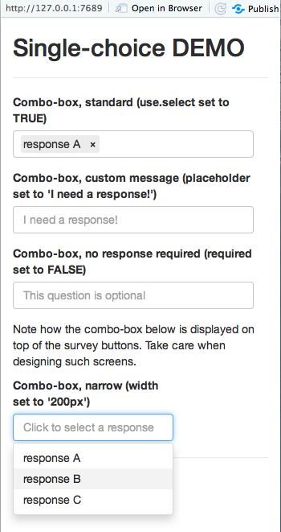

# interviewer quick-start

Table of contents

- [Basic ui.R and server.R code](#basics)<br />
- [Examples](#examples)<br />
- [Longer questionnaires, splitting questions into pages](#pages)<br />
- [Standard question definitions](#questions)<br />
  - [Validation](#validation)<br />
  - [Single-choice](#single-choice)<br />
  - [Multiple-choice](#multiple-choice)<br />
  - [Mixed-choice](#mixed-choice)<br />
  - [Text](#text)<br />
  - [Numeric](#numeric)<br />
- [Response lists](#response-lists)<br />
  - [Dynamic response lists](#dynamic-response-lists)<br />
  - [Merging response lists](#merging-response-lists)<br />
  - [Randomizing response lists](#randomizing-response-lists)<br />
  - [Masking response lists (keep, drop)](#masking-response-lists)<br />
- [Arbitrary Shiny UI](#arbitrary-shiny-ui)<br />
- [Custom question definitions](#custom-questions)<br />
- [Custom question validation](#custom-validation)<br />
- [Questionnaire flow-control](#flow-control)<br />
- [ Navigating backwards and forwards through the questionnaire](#navigation)<br />

<a name="basics" />

## Basic ui.R and server.R code

An `interviewer` questionnaire is "hosted" in a standard Shiny application - it's just 
a single output item in the `ui.R` file (plus an additional "admin" call) 
and a single function call in the `server.R` file.
A minimal example follows (all functions are referenced using package names
just to make it clear what comes from which package):

```r
ui.R:

library(interviewer)
library(shiny)

shiny::fluidPage(
    interviewer::useInterviewer(),
    shiny::uiOutput(outputId = "questionnaireOutput")
)
```

The code above uses Shiny's `fluidPage` but any other layout function could be used as well.

`useInterviewer` must be called at least once to set up `interviewer`-specific CSS and JavaScript.
And since `interviewer` uses the `shinyjs` package, it calls its `useShinyjs` method as well.

The second instruction defines the output field where all generated questionnaire output
will be displayed. Since it's just one output field, you can add any other valid Shiny output
before or after `interviewer` code.

```r
server.R:

library(interviewer)
library(shiny)

function(input, output) {

    output$questionnaireOutput <-
        interviewer::questionnaire(
            label = "Simple DEMO",
            welcome = "Welcome",
            goodbye = "Done!",

            interviewer::question.list(
                id = "q1",
                label = "Question 1",
                responses = interviewer::buildResponses(
                    id = c("a", "b", "c"),
                    label = c("response A", "response B", "response C")
                )
            ),

            exit = function(data) {
                cat("Done:\n")
                print(data)
            }
        )

}
```

The `questionnaire` call above defines the title of the survey that will be displayed
at the top of the output field. Next, it defines two pages: a `welcome` page and a `goodbye` page
that will be displayed before the interview starts and after it ends. Here, this is just text,
but it can be any valid Shiny output.

Next come a series of questions, UI elements, page-breaks, and function definitions
that make up the full questionnaire definition. Here, it's a single, single-choice question
that displays `"Question 1"` as its label, and displays three responses (in this case, using radio-buttons).

While the `buildResponses` function is called here to construct response ids and labels,
this is just a standard R data.frame. As such, you can construct this data.frame using
whatever R code you'd like to use (including things like randomization of responses).
`buildResponses` is just a helper function like some other question and response helper functions.


While the texts `"Question 1"` and `"response A"` to `"response C"` will be displayed on the screen,
the data will be saved in the `"q1"` column, and it will be one of the values: `"a"`, `"b"`, or `"c"`.

And that's what the final argument of the `questionnaire` does: `exit` defines a callback function
that will be called when the respondent is done with the interview. The function will be called
with the data.frame that contains the respondent's answers. Here, it just prints the results,
but you may choose to save the data to a database, a file, etc.:

```
Done:
  q1
1  b
```

<a name="examples" />

## Examples

The `interviewer` package comes with a `runExample()` function - 
you can use it to run the different examples discussed below.
Call `runExample()` with no arguments to get a list of valid examples.
Pass the example name, as a string parameter, to run a specific example (e.g. `runExample("single-choice")`).

<a name="pages" />

## Longer questionnaires, splitting questions into pages

Obviously, you can build longer than just one-question questionnaires.
Just add more question definitions in the `...` part of the call to `questionnaire`.

You may also choose to break the questionnaire into pages or screens -
so that the respondent in not overwhelmed when presented with a very long web page.

From now on `ui.R` code will be omitted - it's the same for all examples.
And screenshots of the welcome and goodbye pages will also be dropped.

And, for most examples, we'll define a single response list that can be reused
in multiple questions (which, BTW, shows how R *is* the questionnaire scripting language
and can be used to define common question elements).

```r
server.R:

library(interviewer)
library(shiny)

function(input, output) {

    responses = interviewer::buildResponses(
        id = c("a", "b", "c"),
        label = c("response A", "response B", "response C")
    )
    
    output$questionnaireOutput <-
        interviewer::questionnaire(
            label = "Simple DEMO",
            welcome = "Welcome",
            goodbye = "Done!",

            interviewer::question.list(
                id = "q1",
                label = "Question 1",
                responses = responses
            ),

            interviewer::question.list(
                id = "q2",
                label = "Question 2",
                responses = responses
            ),

            interviewer::pageBreak(),

            interviewer::question.list(
                id = "q3",
                label = "Question 3",
                responses = responses
            ),

            exit = function(data) {
                cat("Done:\n")
                print(data)
            }
        )

}
```

In the above, we have two questions on the first page, and one question on the second page.


You can use the Back and Next buttons to navigate to earlier questions
and then back to the current question.

And the resulting data.frame:

```
Done:
  q1 q2 q3
1  a  b  c
```

<a name="questions" />

## Standard question definitions

Up till now, only simple, single-response questions were shown. However, `interviewer` comes
equipped with several question templates for the most common scenarios
(plus, you can build your questions from scratch, but that's for later).

<a name="validation" />

### Validation

All pre-defined question templates take a `required` argument; if it's `TRUE` (default),
the validation function will not let the respondent move to the next page without answering the question.
If it's `FALSE`, the respondent may choose not to select/provide a response.


<a name="single-choice" />

### Single-choice

Single-choice questions have several options: you can display those as radio-buttons (recommended, default)
or combo-boxes. And if you decide to use radio-buttons, you can display those vertically (default) or inline/horizontally.

```r
server.R - radio-buttons:

            . . .

            interviewer::question.list(
                id = "RadioButtonsStandard",
                label = "Radio-buttons, standard",
                responses = responses
            ),

            interviewer::question.list(
                id = "RadioButtonsInline",
                label = "Radio-buttons, inline (inline set to TRUE)",
                responses = responses,
                inline = TRUE
            ),

            interviewer::question.list(
                id = "RadioButtonsOptional",
                label = paste("Radio-buttons, no response required",
                              "(required set to FALSE; a second click on a selected radio-button", 
                              "deselects it)"),
                responses = responses,
                required = FALSE
            ),

            interviewer::question.list(
                id = "RadioButtonsNarrow",
                label = "Radio-buttons, inline and narrow (width set to '250px')",
                responses = responses,
                inline = TRUE,
                width = "250px"
            ),

            . . .
```            

The first question is just a standard single-choice question as seen earlier.
The second question uses `inline` (horizontal) layout.
The third question sets `required` to `FALSE`, meaning the respondent is free to now answer the question.
The final question shows basic styling of the question layout - changing its `width`
(note that, in this case, radio-buttons wrap over multiple lines).

All questions are initially displayed without any pre-selected responses;
the respondent is always free to deselect a response,
even when the question uses radio-buttons.


And now, a similar set of questions, but using (single-selection) combo-boxes:

```r
server.R - single-choice combo-boxes:
            
            . . .

            interviewer::question.list(
                id = "ComboBoxStandard",
                label = "Combo-box, standard (use.select set to TRUE)",
                responses = responses,
                use.select = TRUE
            ),

            interviewer::question.list(
                id = "ComboBoxPlaceholder",
                label = "Combo-box, custom message (placeholder set to 'I need a response!')",
                responses = responses,
                use.select = TRUE,
                placeholder = "I need a response!"
            ),

            interviewer::question.list(
                id = "ComboBoxOptional",
                label = "Combo-box, no response required (required set to FALSE)",
                responses = responses,
                use.select = TRUE,
                placeholder = "This question is optional",
                required = FALSE
            ),

            interviewer::question.list(
                id = "ComboBoxNarrow",
                label = "Combo-box, narrow (width set to '200px')",
                responses = responses,
                use.select = TRUE,
                width = "200px"
            ),
            
            . . .

```

The first question is just a standard single-choice question,
but sets `use.select` to `TRUE` to display as a combo-box.
The second question defines a `placeholder` that will be displayed as a hint
in the edit area of the combo-box before any selections are made.
The third question sets `required` to `FALSE`, meaning the respondent is free to not answer the question.
The final question shows basic styling of the question layout - changing its `width`.



A note on using combo-boxes: they're harder to use (for respondents) 
than radio-buttons - they require two clicks to select a response instead of one.
Combo-boxes can also display on top of subsequent questions or navigation buttons (as in the screenshot above),
hiding contents and requiring yet another click outside of the pull-down list.

So, combo-boxes should really be used only when the list of responses is very long
(respondents can then filter the list by typing a part of the response text).

The above code comes from the `"single-choice"` example - execute `runExample("single-choice")`.

<a name="multiple-choice" />

### Multiple-choice

Similarly to single-choice questions, multiple-choice questions have several options:
you can display those as check-boxes (recommended, default) or combo-boxes.
And if you decide to use check-boxes, you can display those vertically (default) or inline/horizontally.

```r
server.R - check-boxes:

            . . .

            interviewer::question.list(
                id = "CheckBoxesStandard",
                label = "Check-boxes, standard (multiple set to TRUE)",
                responses = responses,
                multiple = TRUE
            ),

            interviewer::question.list(
                id = "CheckBoxesInline",
                label = "Check-boxes, inline (inline set to TRUE)",
                responses = responses,
                multiple = TRUE,
                inline = TRUE
            ),

            interviewer::question.list(
                id = "CheckBoxesOptional",
                label = "Check-boxes, no response required (required set to FALSE)",
                responses = responses,
                multiple = TRUE,
                required = FALSE
            ),

            interviewer::question.list(
                id = "CheckBoxesNarrow",
                label = "Check-boxes, inline and narrow (width set to '250px')",
                responses = responses,
                multiple = TRUE,
                inline = TRUE,
                width = "250px"
            ),

            . . .
```            

The first question is just a standard multiple-choice question.
The second question uses `inline` (horizontal) layout.
The third question sets `required` to `FALSE`, meaning the respondent is free to now answer the question.
The final question shows basic styling of the question layout - changing its `width`
(note that, in this case, check-boxes wrap over multiple lines).

All questions are initially displayed without any pre-selected responses;
the respondent is always free to deselect a response.


And again, a similar set of questions, but using (multiple-selection) combo-boxes:

```r
server.R - multiple-choice combo-boxes:

            . . .

            interviewer::question.list(
                id = "ComboBoxStandard",
                label = "Combo-box, standard (use.select set to TRUE)",
                responses = responses,
                multiple = TRUE,
                use.select = TRUE
            ),

            interviewer::question.list(
                id = "ComboBoxPlaceholder",
                label = "Combo-box, custom message (placeholder set to 'I need a response!')",
                responses = responses,
                use.select = TRUE,
                multiple = TRUE,
                placeholder = "I need a response!"
            ),

            question.list(
                id = "ComboBoxOptional",
                label = "Combo-box, no response required (required set to FALSE)",
                responses = responses,
                use.select = TRUE,
                multiple = TRUE,
                placeholder = "This question is optional",
                required = FALSE
            ),

            interviewer::buildNonQuestion(
                ui = shiny::p(paste(
                    "Note how the combo-box below is displayed on top of the survey buttons.",
                    "Take care when designing such screens (works ok for single-choice questions",
                    "but may not for multi-choice ones)."
                ))
            ),

            interviewer::question.list(
                id = "ComboBoxNarrow",
                label = "Combo-box, narrow (width set to '200px')",
                responses = responses,
                use.select = TRUE,
                multiple = TRUE,
                width = "200px"
            ),

            . . .
```            

The first question is just a standard multiple-choice question,
but sets `use.select` to `TRUE` to display as a combo-box.
The second question defines a `placeholder` that will be displayed as a hint
in the edit area of the combo-box before any selections are made.
The third question sets `required` to `FALSE`, meaning the respondent is free to not answer the question.
The final question shows basic styling of the question layout - changing its `width`.

The "non-question" before the final question is an example of arbitrary Shiny output 
that can be displayed anywhere in the questionnaire.


The above code comes from the `"multiple-choice"` example - execute `runExample("multiple-choice")`.

<a name="mixed-choice" />

### Mixed-choice

In progress, but check out `interviewer` examples using `runExample()`...

<a name="text" />

### Text

<a name="numeric" />

### Numeric

<a name="response-lists" />

### Response lists

<a name="dynamic-response-lists" />

### Dynamic response lists

<a name="merging-response-lists" />

### Merging response lists

<a name="randomizing-response-lists" />

### Randomizing response lists

<a name="masking-response-lists" />

### Masking response lists (keep, drop)

<a name="arbitrary-shiny-ui" />

## Arbitrary Shiny UI

<a name="custom-questions" />

## Custom question definitions

<a name="custom-validation" />

## Custom question validation

<a name="flow-control" />

## Questionnaire flow-control

<a name="navigation" />

## Navigating backwards and forwards through the questionnaire
